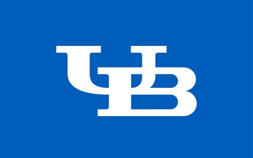

## About Me

My name is Chris Goodwin, and I am an aspiring data scientist! I have always had a passion for two things: numbers and sports. I realized early on that I did not have the skills to become a professional athlete, so I turned to the back of the trading cards and learned all of the stats that I could. It would be my ultimate dream to work in the sports data arena.

I currently live in Buffalo, NY with my fiancee Courtney and our dog Riley! If we're not out at the dog park, you can pretty much always count on us to be bundled up on the couch watching some Netflix.

### Education
 **University at Buffalo**: August 2010 - May 2014 
  - Bachelor of Science in Mathematics
  - Minor in Statistics
  - Cumulative GPA of 3.64
  
 **Bellevue University**: August 2019 - Present 
  - Masters of Science in Data Science
  - Cumulative GPA of 4.00

### Professional Experience

 *Randomization Coordinator* at **Frontier Science**, May 2015 - August 2019 
  - Worked with data managers, pharmacists, and statisticians to develop and maintain clinical trial protocols. 
  - Configured the Subject Enrollment System for the trials and monitored data daily. 
  - Corrected and queried data in vast relational databases. 
  - Provided support for site users accessing our system.  
  - Created and maintained Standard Operating Procedures and Work Instructions for the department.  
  - Aided in the development, testing, and installation of a new Enrollment System.     

 *SDTM Specialist* at **Frontier Science**, August 2019 - Present 
  - Assist with the development of data collection instruments that comply with Clinical Data Acquisition Standards Harmonization (CDASH) standards.
  - Work on related projects in support of Clinical Data Interchange Standards Consortium (CDISC) implementation standards.  
  - Coordinate the annotating, modeling and mapping of the Study Data Tabulation Model (SDTM) for assigned studies and maintain these mappings throughout the life of the study, including QA/QC, traceability and validation of the data flow to SDTM. 
  - Define additional processing requirements for the final SDTM, working closely with computer programmers and statisticians as they develop Analysis Data Model (ADaM) datasets.

Thanks again for taking the time to look at my portfolio, and if you have any questions head over to the contact page and I'll be sure to get back to you!

