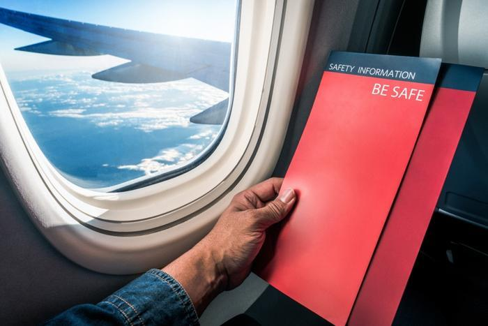
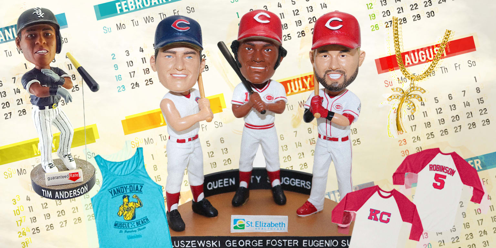
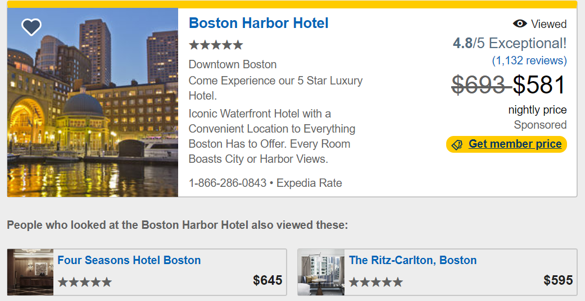
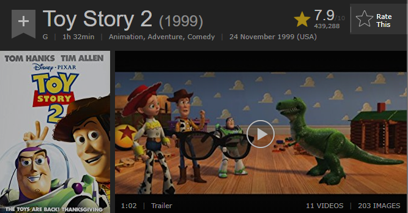
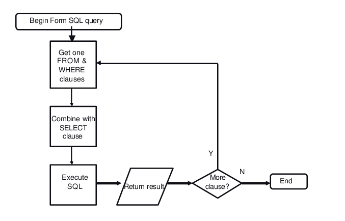

## Projects

As I stated on the home screen, I chose these projects to show I am not one-dimensional. I can perform a many number of tasks with the data science realm. Below are a list of projects, with a brief description and a link to the Github repository:

### Project #1: [**Airline Safety Analysis**](https://github.com/cgoodwin61/Portfolio/tree/main/Airline_Safety_Analysis)

- In this project, we really focused in on utilizing data visualization tools to tell a story. The ultimate goal was to prove airline travel was safe, and I believe we did just that. 

### Project #2: [**College Basketball Analysis**](https://github.com/cgoodwin61/Portfolio/tree/main/College_Basketball_Analysis)

- In this project, we attempted to create a model that could predict how many wins a given college basketball team would have in a season, but on certain characteristics (offensive efficiency, rebounding, conference, etc). 

### Project #3: [**Baseball Game Promotions**](https://github.com/cgoodwin61/Portfolio/tree/main/Dodger_Games)

- In this project, we analyze LA Dodger game promotions, and determine if there are specific days our times of the year they should run these promotions to maximize their attendance. This showcases skills in both Python and R. 

### Project #4: [**Hotel Recommendation Model**](https://github.com/cgoodwin61/Portfolio/tree/main/Hotel_Recommendation_Model)

- In this project we build a model to predict which hotels given users would be prone to book. 

### Project #5: [**Coding with R**](https://github.com/cgoodwin61/Portfolio/tree/main/R_Skills)

- In this project, I simply showcase a wide array of tools in the R coding language. We analyze COVID-19 data throughout. 

### Project #6: [**Movie Rating Analysis**](https://github.com/cgoodwin61/Portfolio/tree/main/Movie_Rating_Analysis)

- This project highlights data scraping tools. We evaluated moving rating data from three sources: a csv download, an HTML scrape, and an API. 

### Project #7: [**NFL Quarterback Analysis**](https://github.com/cgoodwin61/Portfolio/tree/main/QB_Analysis)

- In this project, I attempted to use QB Game Logs to predict whether or not his team won the game. This showcased my skills using classification algorithms in Python.

### Project #8: [**SQLite Examples**](https://github.com/cgoodwin61/Portfolio/tree/main/SQLite_Example)

- This project highlights my skills in running queries, both in SQL in general and specifically within the SQLite package. 

### Project #9: [**Spotify Popularity Analysis**](https://github.com/cgoodwin61/Portfolio/tree/main/Spotify_Analysis)

- In this project, I attempted to predict the popularity of a song on Spotify based on some characteristics of the song (tempo, volume, date, etc). This showcased my skills using regression algorithms in Python.

### Project #10: [**Chest X-Ray Classification**](https://github.com/cgoodwin61/Portfolio/tree/main/Chest_XRays)

- In this project, I built an image classification model that would predict whether a given set of lungs was healthy or had pneumonia. While still somewhat a novice at image classification, this project shows an understanding of how to use and interpret a model in keras.
